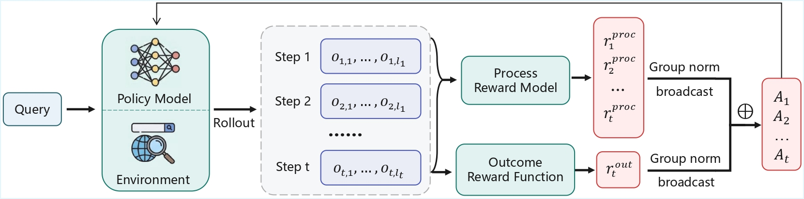

<div align="center">

# 🧩 ProRAG: Process-Supervised Reinforcement Learning for Retrieval-Augmented Generation

[](https://arxiv.org/abs/2601.21912)
[](https://huggingface.co/collections/bmbgsj/prorag)
[](https://opensource.org/licenses/MIT)
[](https://www.python.org/downloads/)

**ProRAG is a process-supervised reinforcement learning framework designed to resolve the credit assignment problem in multi-hop RAG tasks.**

</div>

---

## 📢 Latest News

- **[January 30, 2026]** 📄 Our paper is now available on **[arXiv](https://arxiv.org/abs/2601.21912)**.
- **[January 29, 2026]** 🤗 We have released our models on **[Hugging Face](https://huggingface.co/collections/bmbgsj/prorag)**.


---

## 📑 Table of Contents

- [Overview](#-overview)
- [Repository Structure](#-repository-structure)
- [Installation](#-installation)
  - [Prerequisites](#prerequisites)
  - [ProRAG Environment](#prorag-environment)
  - [Retriever Environment](#retriever-environment-optional)
- [Usage](#-usage)
  - [Step 0: Retrieval Service & Data](#0-retrieval-service--data)
  - [Stage 1: Supervised Policy Warmup](#1-supervised-policy-warmup)
  - [Stage 2: Process Reward Modeling](#2-process-reward-modeling)
  - [Stage 3: Reasoning Refinement](#3-reasoning-refinement)
  - [Stage 4: Process-Supervised RL](#4-process-supervised-rl)
- [Citation](#-citation)
- [License](#-license)

---

## ✨ Overview

Retrieval-Augmented Generation (RAG) models often suffer from reward sparsity and inefficient credit assignment when optimized with traditional outcome-based Reinforcement Learning (RL). Coarse-grained scalar rewards fail to identify specific erroneous steps within long-horizon trajectories, leading to **"process hallucinations"**—where models reach correct answers through flawed logic.

**ProRAG** addresses these challenges by integrating learned step-level supervision directly into the online optimization loop.

Our framework consists of four progressive stages:

1.  **Supervised Policy Warmup (SFT):** Initialize the model with a structured reasoning format.
2.  **MCTS-based Process Reward Model (PRM):** Quantify intermediate reasoning quality using Monte Carlo Tree Search.
3.  **PRM-Guided Reasoning Refinement (RFT):** Align the policy with fine-grained process preferences to mitigate the cold-start problem.
4.  **Process-Supervised Reinforcement Learning:** Optimize with a **dual-granularity advantage mechanism** that aggregates step-level process rewards with global outcome signals.



---

## 🚀 Installation

### Prerequisites
- Python 3.13+
- CUDA 12.x (Recommended)

### ProRAG environment

```bash
# 1. Create and activate conda environment
conda create -n prorag python=3.13.11
conda activate prorag

# 2. Install vLLM
pip install vllm==0.11.0

# 3. Install Requirements
pip install -e .

# 4. Install Flash Attention 2
pip install flash-attn==2.8.3 --no-build-isolation

# 5. Install W&B
pip install wandb
wandb login
```

### Retriever environment (optional)

If you would like to call a local retriever as the search engine, you can install the environment as follows. (We recommend using a separate environment.)

```bash
conda create -n retriever python=3.10
conda activate retriever

# We recommend installing torch with conda for faiss-gpu
conda install pytorch==2.4.0 torchvision==0.19.0 torchaudio==2.4.0 pytorch-cuda=12.1 -c pytorch -c nvidia
pip install transformers datasets pyserini

# Install the gpu version faiss to guarantee efficient RL rollout
conda install -c pytorch -c nvidia faiss-gpu=1.8.0

# API function
pip install uvicorn fastapi
```

---

## 💻 Usage

Our training pipeline corresponds strictly to the four stages described in the paper. 

### 0. Retrieval Service & Data
Before running any training or generation tasks, you need to start the retrieval service and prepare the data for training.

```bash
conda activate retriever
export RETRIEVAL_PATH="data/indices/wikipedia"

# 1. Download Index
bash search/download.sh

# 2. Launch Service
bash search/retrieval_launch.sh
```
> Tip: Keep this terminal open. Open a new terminal and activate prorag for the next steps.

```bash
conda activate prorag

# Data Preprocessing requires an API Key (OpenAI/DeepSeek/vLLM)
export OPENAI_API_KEY="YOUR_KEY"
bash scripts/preprocess.sh
```

### 1. Supervised Policy Warmup
Fine-tune the model using constructed datasets with structured reasoning-action formats to establish a reference policy ($\pi_{sft}$).

```bash
bash scripts/sft.sh
```

### 2. Process Reward Modeling
Train the Process Reward Model (PRM) using contrastive pairs collected via **Monte Carlo Tree Search (MCTS)**. This model provides step-level feedback.

```bash
# Ensure you have sufficient GPU memory for vLLM servers
export OPENAI_API_KEY="YOUR_KEY"
bash scripts/prm.sh
```

> **⚠️ Note:** Ensure your GPUs have sufficient memory. The script automatically spins up vLLM servers on GPUs 0-3 for parallel MCTS generation, and then releases resources for the subsequent PRM training.

### 3. Reasoning Refinement
Perform Rejection Sampling Fine-Tuning (RFT) using high-quality trajectories filtered by the PRM. This step bridges the gap between SFT and RL.

```bash
bash scripts/rft.sh
```

### 4. Process-Supervised RL
Finally, run the online reinforcement learning with the **Dual-Granularity Advantage** mechanism, combining outcome rewards and process rewards.

```bash
bash scripts/rl.sh
```

## 📝 Citation

@misc{wang2026proragprocesssupervisedreinforcementlearning,
      title={ProRAG: Process-Supervised Reinforcement Learning for Retrieval-Augmented Generation}, 
      author={Zhao Wang and Ziliang Zhao and Zhicheng Dou},
      year={2026},
      eprint={2601.21912},
      archivePrefix={arXiv},
      primaryClass={cs.AI},
      url={https://arxiv.org/abs/2601.21912}, 
}

---

## 📄 License

This project is licensed under the MIT License.
